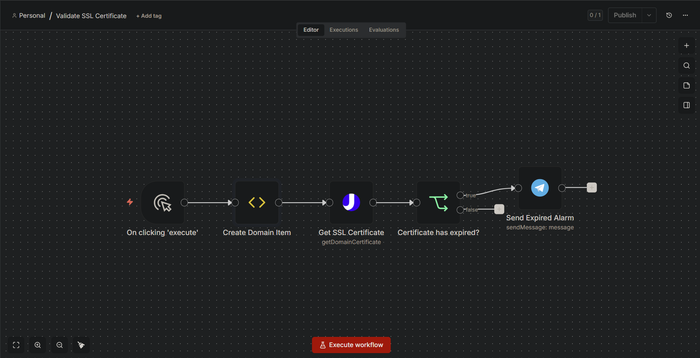
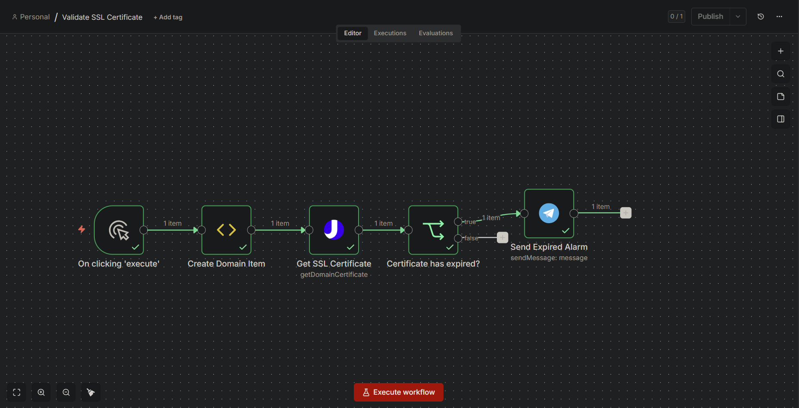

# 00053 - SSL Expiry Checker
> **Título del flujo:** Get SSL Certificate

## 00053-ssl-expiry-checker.json

---

## ¿Qué hace?

Verifica de forma manual si el certificado SSL de un dominio específico está vencido o no. Consulta la API de uproc.io para obtener el estado del certificado y, si el resultado indica que no es válido, envía una alerta por Telegram al canal configurado.

---

## ¿Cómo lo hace?

1. **Manual Trigger** — Se ejecuta manualmente al hacer clic en "Execute".
2. **Create Domain Item** — Define el dominio a verificar (por defecto `n8n.io`) como variable en el item.
3. **Get SSL Certificate** — Consulta la API de uproc.io usando la herramienta `getDomainCertificate` del grupo `internet`, que devuelve información del certificado SSL incluyendo el campo `valid`.
4. **Certificate has expired?** — Evalúa si el campo `valid` retornado por uproc.io es `"false"` (como string).
5. **Send Expired Alarm** — Si el certificado está vencido, envía un mensaje de alerta por Telegram indicando el dominio afectado.

---

## Evidencias de Funcionamiento

---

## Ajustes Realizados

- Flujo probado y funcional (estado: ✅ OK).
- El flujo alerta por Telegram cuando el valor booleano `valid` retornado por la API de uproc.io es `false`.
- El dominio a verificar está hardcodeado en el nodo "Create Domain Item" — se debe actualizar manualmente antes de cada ejecución.

> **Integración destacada:** uproc.io (`https://app.uproc.io`) es una plataforma útil para el enriquecimiento de datos sobre correos electrónicos y dominios. Vale la pena explorar sus otras herramientas disponibles.

---

## Conclusiones y Recomendaciones

- El flujo es funcional pero muy básico: solo verifica un dominio por ejecución y de forma manual.
- **Recomendación principal:** Combinar con el flujo `07177-ssl-expiry-monitor` que sí maneja múltiples dominios desde Google Sheets y se ejecuta semanalmente de forma automática.
- Si se quiere mantener este flujo, agregar un Schedule Trigger y una lista de dominios en lugar del dominio hardcodeado.
- La integración con uproc.io es el componente más valioso: explorar otras herramientas del grupo `internet` para enriquecer dominios y correos.
