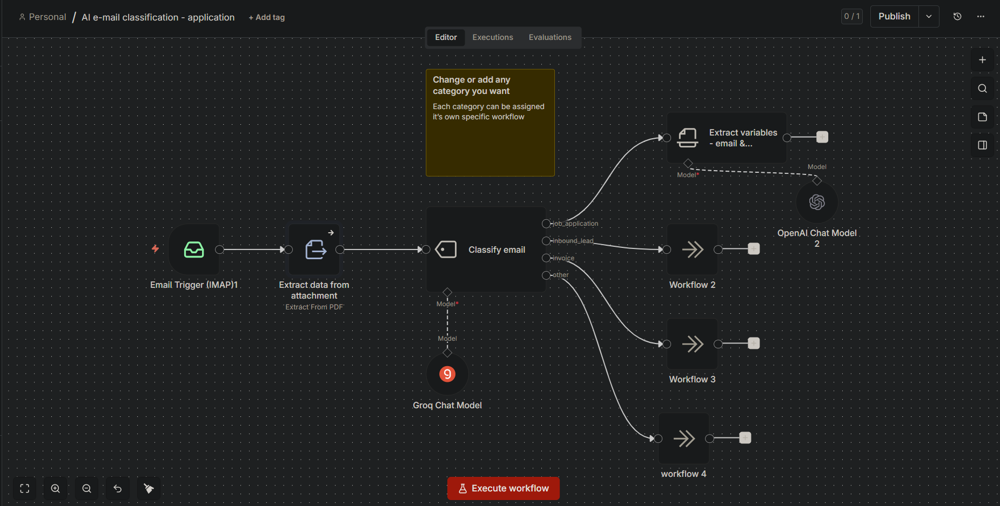
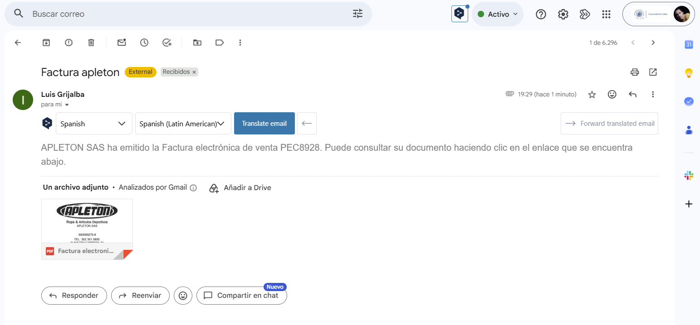
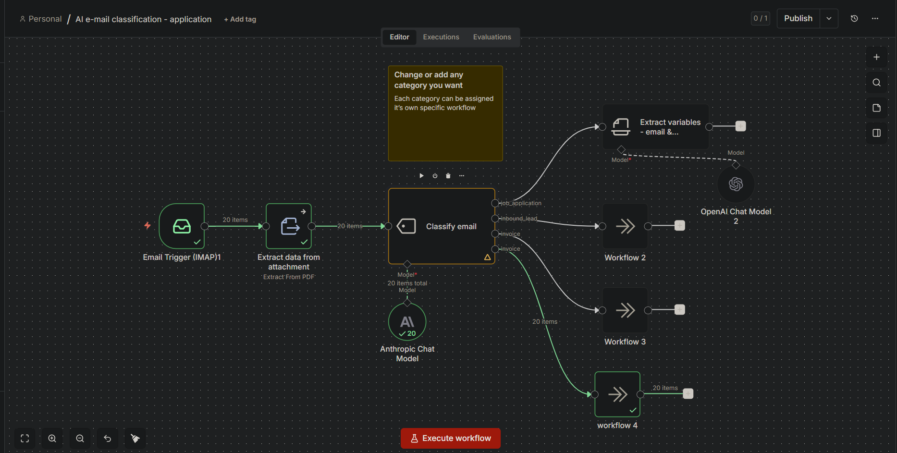

# 00516 - Clasificación Automática de Correos con IA
> **Título del flujo:** OpenAI e-mail classification - application

## 00516-email-classification-ai.json

---

## ¿Qué hace?

Monitorea una bandeja de entrada IMAP y clasifica automáticamente cada correo entrante en una de cuatro categorías usando IA (OpenAI GPT-4o): solicitud de empleo, lead de ventas, factura u otro. Cuando el correo es una solicitud de empleo, extrae además información estructurada del candidato desde el cuerpo del correo y el adjunto PDF (nombre, edad, residencia, estudios, experiencia, perfil personal).

---

## ¿Cómo lo hace?

1. **Email Trigger (IMAP)** — Escucha continuamente la bandeja de entrada. Al llegar un nuevo correo lo procesa automáticamente. Configurado en versión 2 del nodo.
2. **Extract data from attachment** — Extrae el texto del primer adjunto PDF del correo (`attachment0`). Si no hay adjunto, continúa sin error.
3. **Classify email** — Clasifica el correo usando el nodo `textClassifier` de LangChain con GPT-4o. Las categorías son:
   - `job_application` — solicitudes de empleo
   - `inbound_lead` — consultas comerciales
   - `invoice` — facturas
   - `other` — cualquier otro tipo
4. **Ramificación por categoría** — Según la clasificación, el flujo se divide en 4 ramas. La rama `job_application` continúa con procesamiento adicional; las demás llegan a nodos `noOp` (sin operación) preparados para conectar flujos específicos.
5. **Extract variables - email & attachment** — Para las solicitudes de empleo, extrae con GPT-4o los campos: `first_name`, `last_name`, `age`, `residence`, `study`, `work_experience`, `personal_character`.

---

## Evidencias de Funcionamiento

---

## Ajustes Realizados

- Flujo probado y funcional (estado: ✅ OK).
- **Ajuste crítico aplicado:** La versión del nodo trigger IMAP (`n8n-nodes-base.emailReadImap`) se actualizó a la **versión 2** — la versión 1 original no funciona correctamente en versiones recientes de n8n.
- El flujo solo procesa el **primer adjunto** (`attachment0`) e ignora los demás en caso de múltiples adjuntos.

---

## Conclusiones y Recomendaciones

- La clasificación autónoma es el mayor valor de este flujo: no requiere definir palabras clave ni expresiones regulares, la IA infiere el tipo de correo del contenido completo.
- Las ramas `Workflow 2`, `Workflow 3` y `workflow 4` son nodos vacíos (`noOp`) que sirven como puntos de extensión — se deben reemplazar por flujos reales según el caso de uso.
- **Recomendación:** Ampliar el manejo de adjuntos para procesar más de uno por correo en casos donde los candidatos envíen múltiples documentos.
- Considerar agregar una etapa de almacenamiento (Google Sheets, base de datos) para registrar los correos clasificados y los datos extraídos de candidatos.
