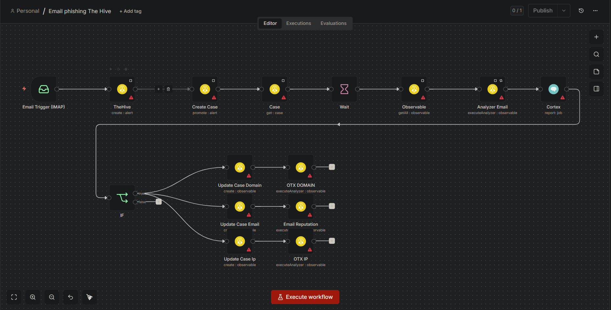

# 00546 - Extracción de IOCs desde Correos con TheHive y Cortex
> **Título del flujo:** Email

## 00546-thehive-email-iocs.json

---

## ¿Qué hace?

Automatiza la gestión de incidentes de seguridad originados en correos electrónicos. Al recibir un correo sospechoso vía IMAP, crea automáticamente un caso en TheHive, analiza el adjunto con Cortex para extraer Indicadores de Compromiso (IOCs) como dominios, IPs y correos maliciosos, y los registra como observables en el caso de seguridad.

---

## ¿Cómo lo hace?

1. **IMAP Email** — Escucha la bandeja de entrada. Al llegar un correo con adjunto lo procesa.
2. **TheHive (crear alerta)** — Crea una alerta en TheHive con el nombre del adjunto como título, etiquetada como tipo "Email" y con el adjunto como artefacto.
3. **Create Case** — Promueve la alerta a un Caso formal de investigación en TheHive.
4. **Case** — Recupera los detalles completos del caso recién creado.
5. **Wait (5s)** — Espera 5 segundos para que TheHive procese el caso antes de continuar.
6. **Observable** — Lista todos los observables del caso.
7. **Analyzer Email** — Ejecuta el analizador de Cortex (`CORTEX`) sobre el observable de tipo archivo para analizar el adjunto.
8. **Cortex** — Recupera el reporte completo del análisis, incluyendo los IOCs encontrados: dominios, IPs y correos.
9. **IF** — Verifica si el reporte contiene al menos un IOC en alguna de las tres categorías.
10. **Update Case Domain / Email / IP** — Si hay IOCs, los registra como observables independientes en el caso, marcados como indicadores de compromiso (`ioc: true`).
11. **OTX Domain / Email Reputation / OTX IP** — Ejecuta analizadores adicionales de Cortex (OTX para dominios e IPs, reputación para correos) sobre cada observable registrado.

---

## Ajustes Realizados

- Flujo **no funcional en el entorno de prueba** (estado: ⛔ No Funcional).
- **Bloqueante principal:** TheHive no permite crear cuentas gratuitas, lo que impide probar el flujo completo sin licencia o instancia propia.
- El flujo no fue modificado respecto al original.

---

## Conclusiones y Recomendaciones

- A pesar de no poderse probar, el flujo tiene un diseño sólido para operaciones de seguridad (SecOps).
- **El paso más valioso es la integración con Cortex:** permite analizar automáticamente archivos adjuntos en busca de malware, dominios maliciosos e IPs comprometidas mediante múltiples motores de análisis.
- **Recomendación:** TheHive puede reemplazarse por **Jira** (gestión de casos como tickets) o cualquier sistema de ticketing que tenga integración con n8n. Cortex puede mantenerse como motor de análisis independiente.
- Alternativa open source: desplegar TheHive + Cortex en un servidor propio (ambos tienen versión community gratuita) para habilitar el flujo completo.
