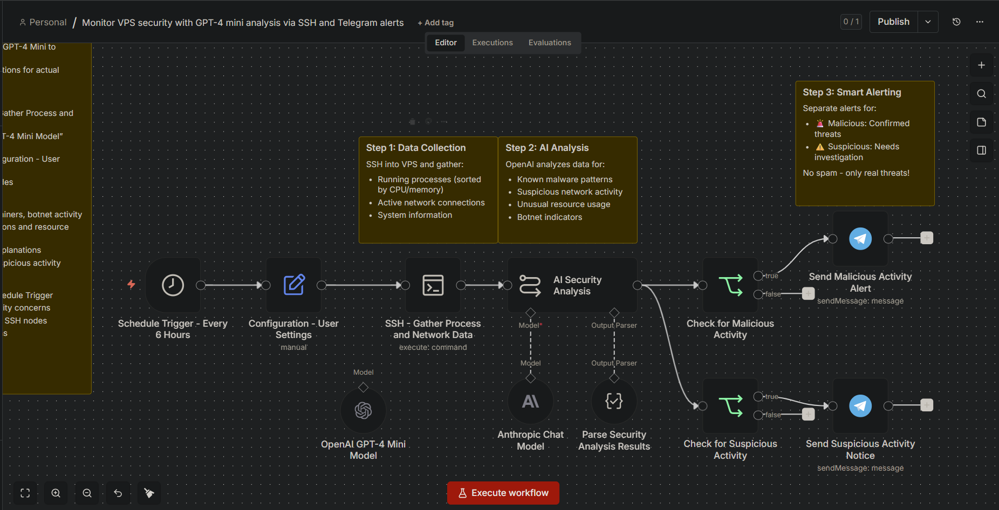
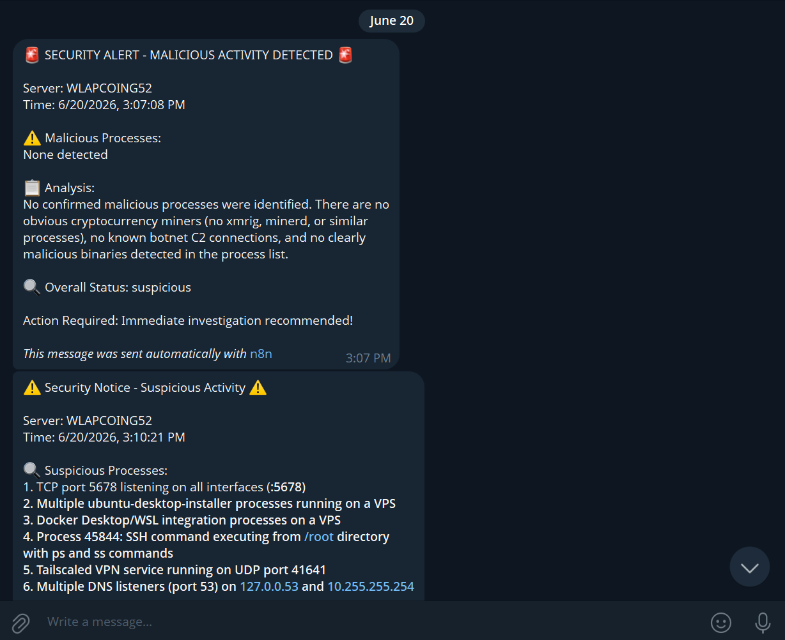

# 03474 - Monitor de Seguridad VPS con GPT-4 mini via SSH y Telegram
> **Título del flujo:** Monitor VPS security with GPT-4 mini analysis via SSH and Telegram alerts

## 03474-Monitor-VPS-security-with-GPT-4-mini-analysis-via-SSH-and-Telegram-alerts.importable.json


---

## ¿Qué hace?

Monitorea automáticamente la seguridad de un servidor Linux cada 6 horas mediante SSH. Recopila información de procesos activos y conexiones de red, la analiza con GPT-4o-mini de OpenAI para detectar amenazas, y envía alertas diferenciadas por Telegram: una alerta roja para actividad maliciosa confirmada y un aviso amarillo para actividad sospechosa.

---

## ¿Cómo lo hace?

1. **Schedule Trigger (cada 6h)** — Dispara el flujo automáticamente cada 6 horas.
2. **Configuration - User Settings** — Centraliza la configuración del usuario: `admin_telegram_id`, `server_name` y `alert_level`. Punto único de configuración para personalizar el flujo.
3. **SSH - Gather Process and Network Data** — Se conecta al servidor vía SSH y ejecuta:
   ```bash
   ps aux --sort=-%cpu,-%mem && ss -tulpn
   ```
   Captura procesos ordenados por CPU/RAM y puertos en escucha con sus procesos asociados.
4. **AI Security Analysis** — Envía la salida del SSH a GPT-4o-mini con un prompt de analista de seguridad. Solicita identificar mineros de criptomonedas, botnets, servicios no autorizados y procesos con consumo anormal.
5. **Parse Security Analysis Results** — Parser estructurado que extrae del análisis: `malicious`, `malicious_explain`, `suspicious`, `suspicious_explain` y `status` (clean/suspicious/compromised).
6. **Check for Malicious Activity** — Verifica si el campo `malicious` tiene contenido.
7. **Check for Suspicious Activity** — Verifica si el campo `suspicious` tiene contenido.
8. **Send Malicious Activity Alert** — 🚨 Envía alerta roja por Telegram con detalle de procesos maliciosos y explicación.
9. **Send Suspicious Activity Notice** — ⚠️ Envía aviso amarillo por Telegram con detalle de actividad sospechosa.

---

## Evidencias de Funcionamiento



**Ejemplo de alerta recibida (06/20/2026):**

```
⚠️ Security Notice - Suspicious Activity ⚠️
Server: WLAPCOING52
Suspicious: Puerto 5678 abierto, procesos WSL/Docker, Tailscale VPN...
Status: suspicious
```

La IA identificó correctamente que el entorno monitoreado era WSL (no un VPS real), detectando el puerto 5678 de n8n, procesos de Docker Desktop y el servicio Tailscale.

---

## Ajustes Realizados

- Flujo probado y funcional (estado: ✅ OK).
- **Corrección de formato:** El archivo original estaba en formato de plantilla de la API de n8n (con metadatos `views`, `user`, `categories`). Se extrajo el objeto `workflow` interno y se generó el archivo `.importable.json` para permitir la importación correcta.
- **Corrección del comando SSH:** El comando original redirigía la salida de `ss -tulpn` a un archivo (`> /vps_process_report.txt`), lo que impedía que el nodo de IA recibiera esa información por stdout. Se corrigió eliminando la redirección.
- **Configuración SSH:** El flujo se conecta a WSL (IP `172.24.116.182`, puerto `22`) desde el contenedor Docker de n8n usando la IP del host Docker (`host.docker.internal` no estaba disponible, se usó la IP directa de WSL).
- **Credenciales Telegram:** Chat ID configurado: `8132561526`.

---

## Conclusiones y Recomendaciones

- El flujo cumple su función principal de monitoreo de seguridad con análisis IA.
- **Limitación actual:** El comando SSH solo captura procesos y puertos. No detecta intentos de fuerza bruta, tareas programadas maliciosas ni archivos modificados recientemente.
- **Recomendaciones de mejora:**
  - Agregar `tail -50 /var/log/auth.log` para detectar intentos de login fallidos.
  - Agregar `crontab -l && ls /etc/cron*` para detectar persistencia maliciosa.
  - Agregar `find /tmp /var/tmp -type f -mmin -60` para archivos sospechosos recientes.
- En producción, apuntar a un VPS Linux real en lugar de WSL para obtener análisis más relevantes.
