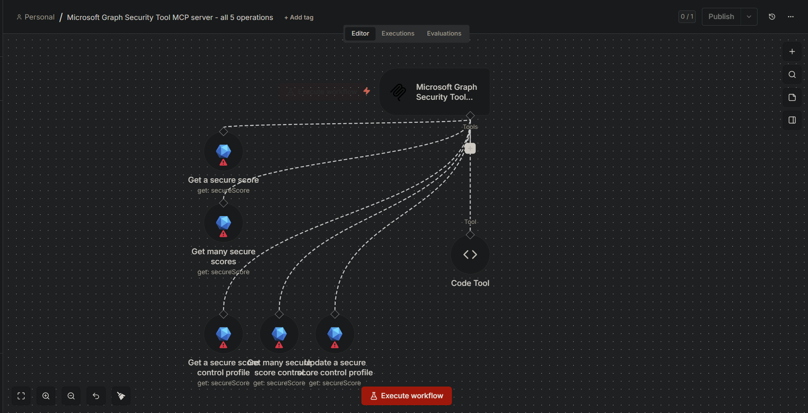
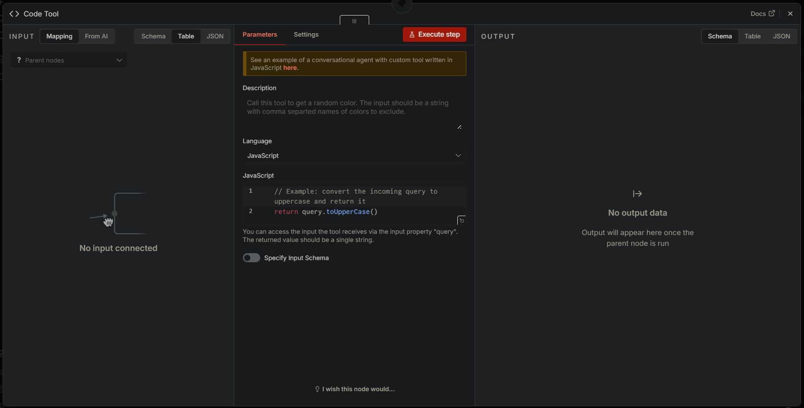
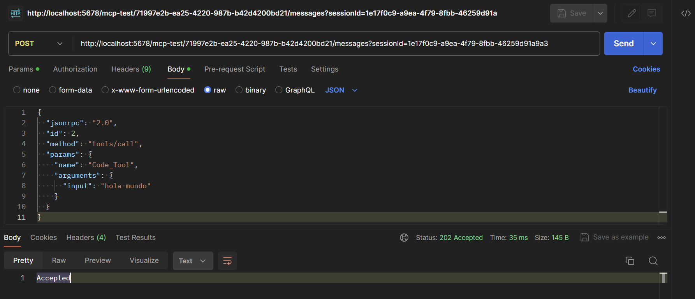
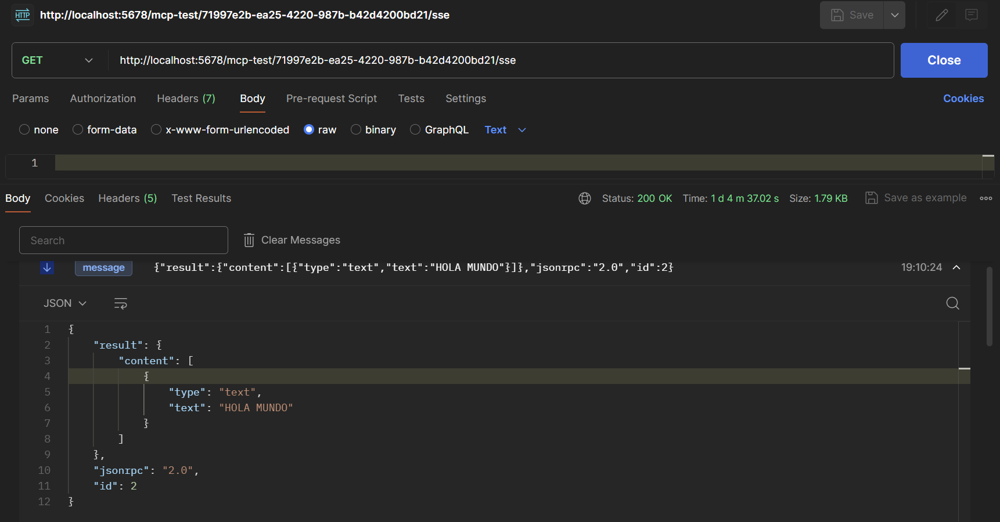

# 06524 - Microsoft Graph Security Tool - Servidor MCP (5 operaciones)
> **Título del flujo:** Microsoft Graph Security Tool MCP server - all 5 operations

## 06524-Microsoft-Graph-Security-Tool-MCP-server-all-5-operations.importable.json



---

## ¿Qué hace?

Expone las 5 operaciones de la API de Microsoft Graph Security como un servidor MCP (Model Context Protocol), permitiendo que agentes de IA como Claude Desktop consulten y actualicen el Secure Score de un tenant de Microsoft 365 de forma conversacional, sin necesidad de programar las llamadas a la API manualmente.

---

## ¿Cómo lo hace?

1. **MCP Server Trigger** — Levanta un endpoint que habla el protocolo MCP. Los agentes de IA se conectan a esta URL para descubrir y ejecutar las herramientas disponibles. URL de prueba:
   ```
   http://localhost:5678/mcp-test/71997e2b-ea25-4220-987b-b42d4200bd21/sse
   ```
2. **Get a secure score** — Recupera el Secure Score actual del tenant de Microsoft 365.
3. **Get many secure scores** — Recupera el historial de Secure Scores a lo largo del tiempo.
4. **Get a secure score control profile** — Obtiene el detalle de un control de seguridad específico.
5. **Get many secure score control profiles** — Lista todos los controles de seguridad disponibles con su estado.
6. **Update a secure score control profile** — Modifica el estado de un control (ej. marcarlo como mitigado, ignorado o resuelto por mitigación alternativa).

Todos los nodos de herramienta se conectan al MCP Trigger mediante conexiones de tipo `ai_tool`, no en un flujo lineal.

---

## Evidencias de Funcionamiento




**Prueba realizada con Postman — protocolo MCP:**

La validación del servidor MCP se realizó usando un flujo auxiliar simple con una tool `Code_Tool` que convierte texto a mayúsculas, en lugar de las tools de Microsoft Graph (que requieren credenciales de Azure). El protocolo MCP fue validado completamente:

1. **Conexión SSE** (`GET /sse`) → `200 OK`, el servidor devolvió la URL de sesión.
2. **Listado de tools** (`tools/list` vía POST al endpoint de mensajes) → `202 Accepted`, la respuesta llegó al stream SSE con el schema de cada tool disponible.
3. **Llamada a tool** (`tools/call` con `name: "Code_Tool"` y `arguments: { "input": "hola mundo" }`) → la tool ejecutó correctamente y devolvió el texto en mayúsculas: `"HOLA MUNDO"`.

Esto confirma que el servidor MCP levanta correctamente, responde al protocolo JSON-RPC 2.0 y ejecuta tools. Las 5 tools de Microsoft Graph seguirán el mismo mecanismo una vez configuradas las credenciales de Azure.

---

## Ajustes Realizados

- **Estado: ✅ Servidor MCP funcional / ☢️ Tools Microsoft Graph no probadas.**
- **Corrección de formato:** El archivo original estaba en formato de plantilla de la API de n8n. Se extrajo el objeto `workflow` interno y se generó el archivo `.importable.json`.
- Las 5 operaciones de Microsoft Graph **no fueron probadas** por falta de credenciales de Azure (Tenant ID, Client ID, Client Secret con permisos `SecurityEvents.Read.All` y `SecurityActions.ReadWrite.All`). La prueba funcional se realizó sobre una tool alternativa (`Code_Tool`) para validar el protocolo MCP de forma independiente a las credenciales.

---

## Conclusiones y Recomendaciones

- El servidor MCP funciona correctamente como infraestructura de exposición de herramientas.
- **Para activar las funcionalidades reales** se requiere registrar una aplicación en Azure Entra ID con los permisos de Microsoft Graph Security.
- La operación **Update** es la única que modifica datos — las demás 4 son solo lectura. Si solo se necesita consulta, se puede eliminar el nodo Update y reducir los permisos requeridos solo a `SecurityEvents.Read.All`.
- **Recomendación:** Conectar a Claude Desktop una vez obtenidas las credenciales para validar el flujo conversacional completo (ej. "¿cuál es mi Secure Score actual?").
- Este patrón (MCP + n8n) es reutilizable para exponer cualquier API como herramientas para agentes IA.
