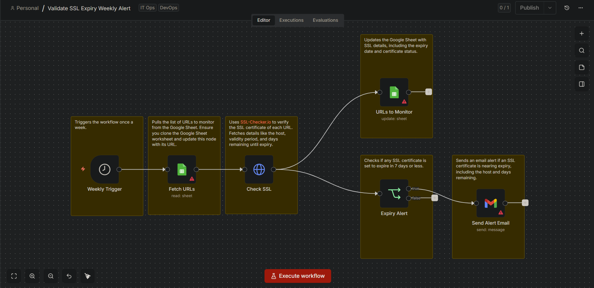
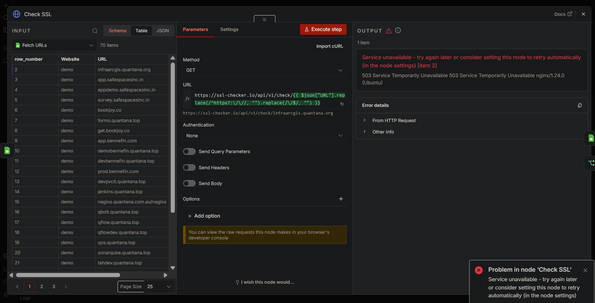

# 07177 - Monitor de Expiración SSL con Google Sheets y Gmail
> **Título del flujo:** SSL Expiry Alert

## 07177-ssl-expiry-monitor.json

---

## ¿Qué hace?

Monitorea semanalmente la fecha de expiración de los certificados SSL de una lista de dominios almacenada en Google Sheets. Consulta la API pública de ssl-checker.io para verificar cada dominio, actualiza la fecha de expiración conocida en la hoja de cálculo y envía una alerta por correo Gmail si algún certificado está a 7 días o menos de vencer.

---

## ¿Cómo lo hace?

1. **Weekly Trigger** — Se ejecuta automáticamente cada lunes a las 8:00 AM.
2. **Fetch URLs** — Lee la lista de dominios a monitorear desde Google Sheets (hoja "URLs to Check"). La hoja tiene columnas: `Website`, `URL`, `KnownExpiryDate`.
3. **Check SSL** — Para cada dominio, consulta la API pública `https://ssl-checker.io/api/v1/check/{dominio}`, que devuelve: `host`, `valid_till`, `days_left`, entre otros campos. Limpia automáticamente los prefijos `http://` y `https://` de la URL.
4. **URLs to Monitor** — Actualiza la fila correspondiente en Google Sheets con la URL verificada y la nueva fecha de expiración (`KnownExpiryDate`), usando `URL` como columna de match.
5. **Expiry Alert (IF)** — Verifica si `days_left` es menor o igual a 7.
6. **Send Alert Email** — Si el certificado está próximo a vencer, envía un correo por Gmail con el asunto y cuerpo: `"SSL Expiry - X Days Left - dominio.com"`.

---

## Evidencias de Funcionamiento

⚠️ **No fue posible obtener resultados completos** debido a fallas en las APIs externas durante las pruebas. Ver sección de Ajustes Realizados.

---

## Ajustes Realizados

- **Estado: ⚠️ Parcialmente probado** — el flujo carga correctamente los dominios desde Google Sheets (70 dominios), pero el nodo `Check SSL` no pudo completar la verificación por fallas en las APIs externas.

**Problema 1 — ssl-checker.io (API original):**
El servicio devolvió un error `503 Service Temporarily Unavailable` al momento de la prueba. La API es gratuita y sin SLA, lo que la hace poco confiable para entornos de producción.

**Problema 2 — Qualys SSL Labs (API alternativa probada):**
Se intentó reemplazar `ssl-checker.io` por `https://api.ssllabs.com/api/v3/analyze`, pero con 70 dominios procesándose en ráfaga devolvió el error:
> *"The service is receiving too many requests from you. Too many new assessments too fast. Please slow down."*

Qualys impone un límite de **1 request cada 10 segundos por IP**, incompatible con el procesamiento en paralelo por defecto de n8n sobre listas grandes.

**Solución pendiente de implementar:** restructurar el flujo agregando un nodo `Split In Batches` (batch size: 1) y un nodo `Wait` de 10 segundos antes del `Check SSL` para respetar el rate limit, o esperar a que `ssl-checker.io` esté disponible nuevamente.

- Toma la lista de dominios desde Google Sheets, lo que permite gestionar múltiples dominios de forma persistente sin modificar el flujo.
- La actualización semanal de `KnownExpiryDate` permite tener un historial visible de fechas de expiración directamente en la hoja de cálculo.
- La alerta de 7 días es configurable modificando el valor en el nodo `Expiry Alert`.

---

## Conclusiones y Recomendaciones

- Es el flujo SSL más completo del conjunto: maneja múltiples dominios, persiste datos y notifica proactivamente.
- **Complemento ideal para `00053-ssl-expiry-checker`:** ese flujo verifica un dominio manualmente; este automatiza el proceso para toda una lista.
- **Recomendaciones de mejora:**
  - Agregar nodo `Split In Batches` + `Wait (10s)` para compatibilidad con Qualys SSL Labs y evitar rate limiting.
  - Agregar una columna `AlertSent` en Google Sheets para evitar enviar múltiples correos por el mismo dominio en semanas consecutivas.
  - Cambiar la alerta de Gmail por Telegram (más inmediata) o agregar ambos canales.
  - Considerar aumentar la frecuencia a diaria cuando los dominios estén a menos de 30 días de vencer.
  - Evaluar una API SSL más robusta con SLA para uso en producción, ya que tanto `ssl-checker.io` como Qualys SSL Labs presentaron limitaciones durante las pruebas.
