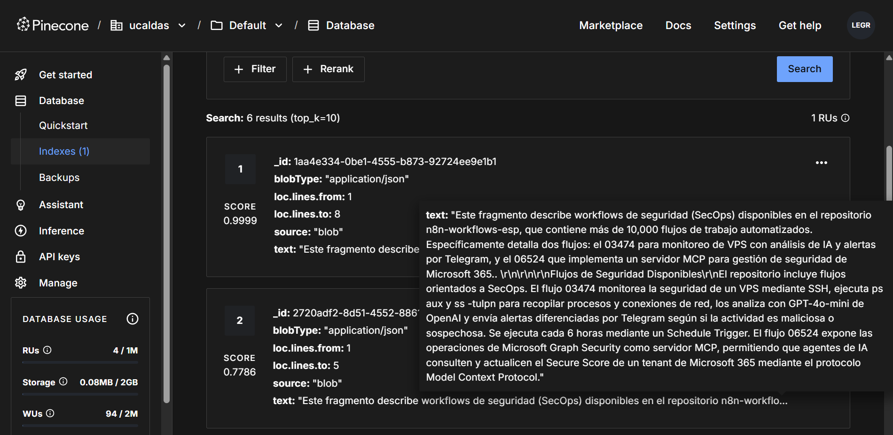

# 07191 - RAG con Context-Aware Chunking: Google Drive → Pinecone
> **Título del flujo:** RAG:Context-Aware Chunking | Google Drive to Pinecone via OpenRouter & Gemini

## 07191-rag_context_chunking.json


---

## ¿Qué hace?

Implementa un pipeline de indexación de documentos para sistemas RAG (Retrieval-Augmented Generation) con una técnica avanzada de "context-aware chunking". Descarga un documento de Google Drive, lo divide en secciones, y antes de vectorizar cada sección, usa un LLM para generar un contexto que describe cómo ese fragmento se relaciona con el documento completo. El resultado (contexto + fragmento) se vectoriza con Google Gemini y se almacena en Pinecone, mejorando significativamente la precisión de recuperación en búsquedas semánticas posteriores.

---

## ¿Cómo lo hace?

1. **Manual Trigger** — Se ejecuta manualmente para iniciar la indexación del documento.
2. **Get Document From Google Drive** — Descarga el documento Google Doc configurado y lo convierte a texto plano (`text/plain`).
3. **Extract Text Data** — Extrae el texto del archivo descargado.
4. **Split Document Text Into Sections** — Divide el texto en secciones usando el separador:
   ```
   —---------------------------—-------------[SECTIONEND]—---------------------------—-------------
   ```
   El documento debe incluir este separador entre cada sección para que el flujo funcione correctamente.
5. **Prepare Sections For Looping** — Convierte el array de secciones en items individuales para procesarlos uno a uno.
6. **Loop Over Items** — Itera sobre cada sección en un loop, procesando una a la vez.
7. **AI Agent - Prepare Context** — Para cada sección, envía al LLM (OpenRouter) el documento completo como contexto y la sección actual como chunk, con el prompt:
   > *"Da un contexto breve y conciso para situar este chunk dentro del documento completo, con el fin de mejorar la recuperación en búsquedas."*
8. **Concatenate context and section text** — Une el contexto generado por la IA con el texto original de la sección: `[contexto generado]. [texto original de la sección]`.
9. **Pinecone Vector Store** — Vectoriza el texto combinado usando **Google Gemini** (`gemini-embedding-001`, 3072 dimensiones) y lo almacena en el índice `context-rag-test` de Pinecone.
10. El loop regresa al paso 6 hasta procesar todas las secciones.

---

## Evidencias de Funcionamiento



---

## Ajustes Realizados

- Flujo probado y funcional (estado: ✅ OK).
- **Modelo de embeddings:** El flujo original usaba `models/text-embedding-004` (768 dimensiones). Se cambió a `models/gemini-embedding-001` (3072 dimensiones) por disponibilidad en la cuenta de Google Gemini configurada.
- **Índice Pinecone:** Se creó el índice `context-rag-test` con **3072 dimensiones** y métrica `cosine` para coincidir con el modelo de embeddings seleccionado.
- **Documento de prueba:** Se creó un Google Doc con documentación técnica del proyecto `n8n-workflows-esp` dividida en 6 secciones usando el separador requerido.
- **Google Drive API:** Se habilitó la API de Google Drive en el proyecto de Google Cloud antes de que el flujo pudiera ejecutarse.

---

## Conclusiones y Recomendaciones

- La técnica de context-aware chunking agrega valor real frente al RAG tradicional: el contexto generado por la IA permite que búsquedas semánticas encuentren chunks relevantes incluso cuando el fragmento por sí solo carece de contexto suficiente.
- **Consideración de costo:** El flujo envía el documento completo al LLM en cada iteración del loop para generar el contexto de cada chunk. En documentos largos con muchas secciones, esto puede incrementar el costo de tokens significativamente.
- **Recomendación:** Para documentos muy largos, considerar un resumen del documento completo (en lugar del documento completo) como contexto enviado al LLM en cada iteración.
- Este flujo es solo la etapa de **indexación** — se necesita un flujo complementario de **consulta RAG** que tome una pregunta, la vectorice con el mismo modelo y busque en Pinecone para obtener los chunks más relevantes.
- Mantener consistencia en el modelo de embeddings: el mismo modelo usado para indexar debe usarse para consultar.
