# Workflows de IA

## 1066-openai-tweet-generator

### Que hace el flujo de trabajo?
Este flujo de trabajo se activa de forma manual para automatizar la creación de contenido y su posterior almacenamiento. En primer lugar, selecciona aleatoriamente un hashtag de una lista predefinida (#techtwitter o #n8n). Luego, realiza una petición HTTP a la API de Google Gemini (utilizando el modelo gemini-2.5-flash) para generar un tweet en español, emocionante y con reglas específicas de longitud y formato basadas en el hashtag elegido. Finalmente, el flujo filtra y limpia los datos obtenidos (el hashtag y el texto del tweet) para guardarlos de manera organizada en una base de datos de Airtable.

### Evidencias

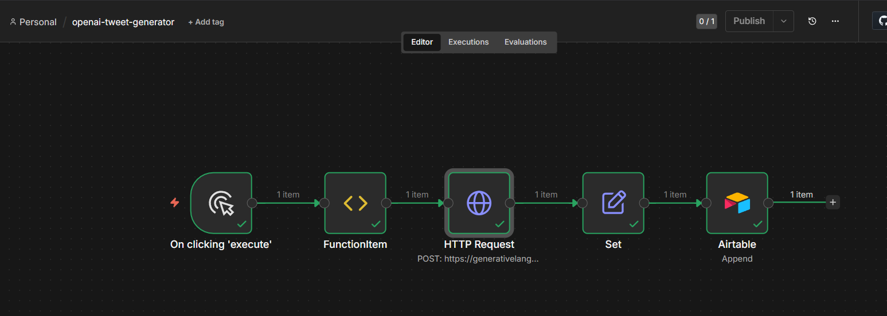

Se demuestra que el flujo de trabajo se ejecutó de forma manual y que cada uno de los componentes (Trigger, FunctionItem, HTTP Request, Set y Airtable) corrieron correctamente de principio a fin sin presentar errores de conexión o de sintaxis.

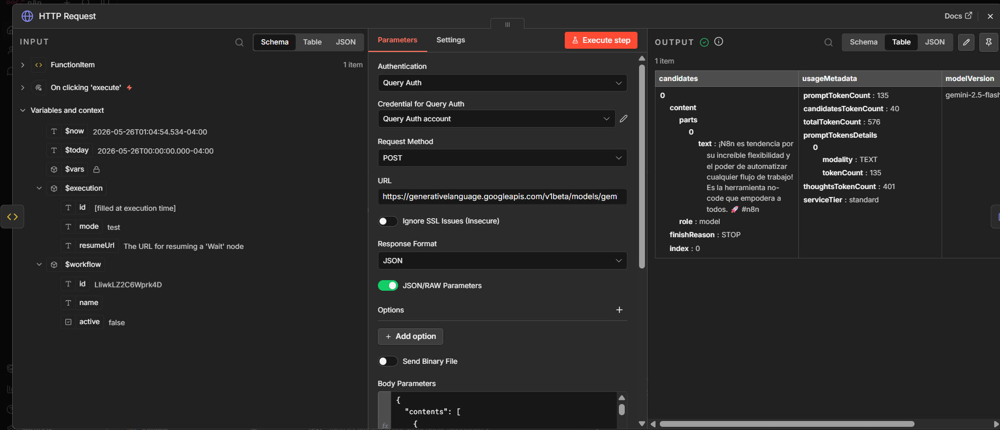

la API de Gemini respondió de manera exitosa (Status 200), mostrando la estructura JSON con el texto del tweet generado bajo los parámetros y reglas solicitadas en el prompt.

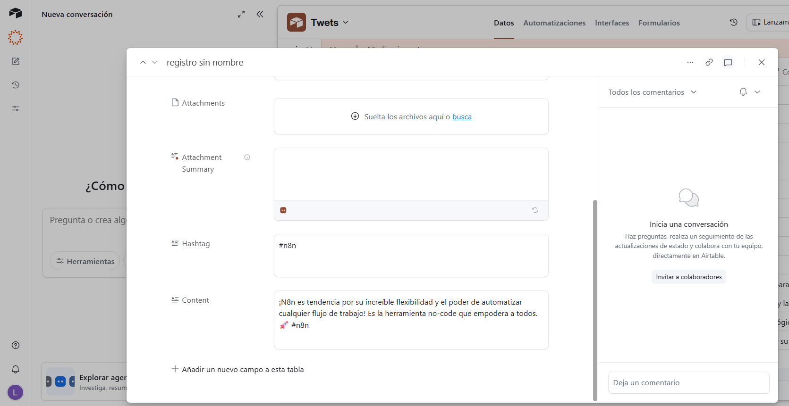

Confirma el éxito final del flujo de trabajo, demostrando que los campos de mapeo del nodo "Set" funcionaron correctamente y que los datos finales ("Hashtag" y "Content") se guardaron de verdad en el destino esperado.

---

## 00681-notion-ai-blog-update

### Que hace el flujo de trabajo?

Este flujo de trabajo automatiza la actualización de un blog en Notion utilizando inteligencia artificial. Se activa de forma manual a través de un disparador específico. El proceso comienza con una función que genera un título para el blog basado en un tema dado. Luego, realiza una petición HTTP a la API de Gemini para obtener el contenido del blog, siguiendo un formato específico. Finalmente, el flujo actualiza una página en Notion con el título y el contenido generado, asegurando que el blog esté siempre actualizado con información relevante y atractiva.

### Evidencias

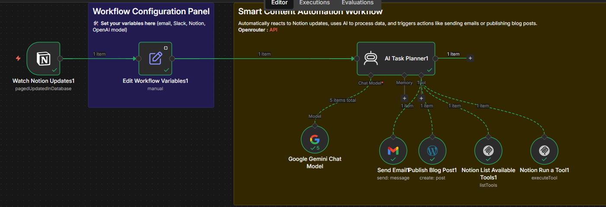

Comprueba que el flujo se completó adecuadamente y que el agente de LangChain logró orquestar e interactuar con todos los nodos subyacentes y el modelo de lenguaje sin interrupciones.

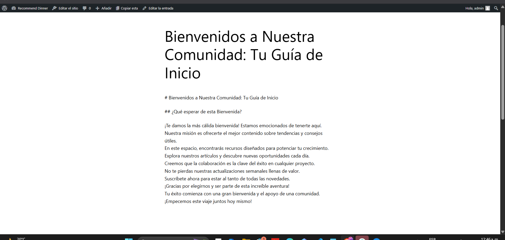

la herramienta "Publish Blog Post1" fue invocada con éxito por el Agente, insertando el título y el contenido SEO estructurado generado por Gemini.

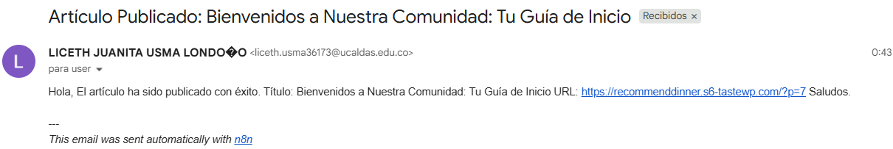

Gmail envió correctamente el mensaje al destinatario configurado con el asunto, título del post y el link directo hacia WordPress.

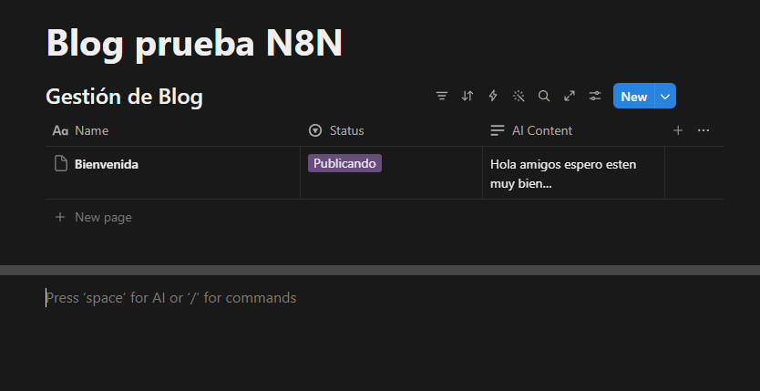

Copia del post en notion

---
# WorkFlows Machine Learning

## 03058-set_medoids_cultivos

### Que hace el flujo de trabajo?
Este flujo de trabajo configura y establece "medoides" (puntos representativos de datos) dentro de un clúster de Qdrant para la detección de anomalías en un conjunto de datos agrícolas (cultivos). Al hacer clic en ejecutar, el flujo define las variables del clúster de Qdrant y extrae el total de puntos de la colección, contabilizando la cantidad de cultivos. Posteriormente, mediante operaciones paralelas, busca y define umbrales de puntuación de distancia y texto para los medoides (tanto de tipo general como específicos de texto) utilizando filtros avanzados. Finalmente, procesa estas métricas para almacenar los medoides idóneos en la base de datos vectorial, quedando listos para servir como puntos de referencia estables que ayuden a identificar comportamientos anómalos o atípicos en el monitoreo de los cultivos.

### Evidencias

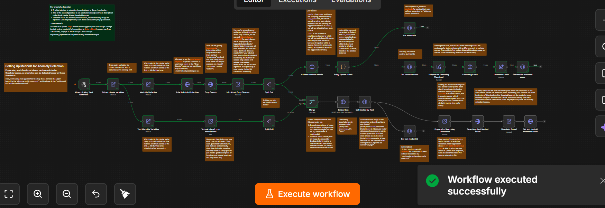

El flujo se ejecutó correctamente desde el activador manual

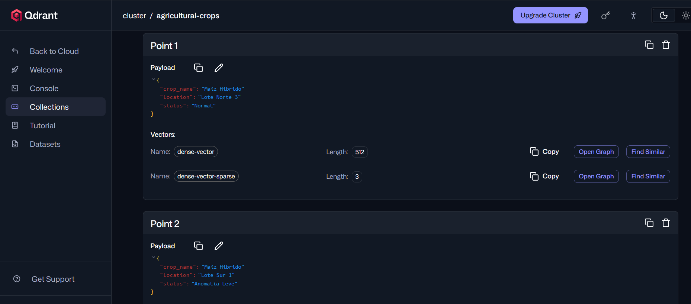

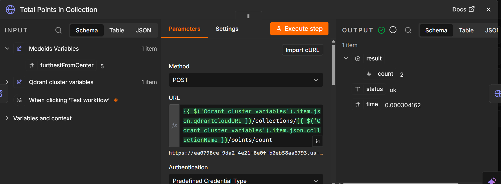

El flujo se conectó exitosamente a Qdrant y recuperó los metadatos necesarios sobre el tamaño actual de la colección del dataset de cultivos.

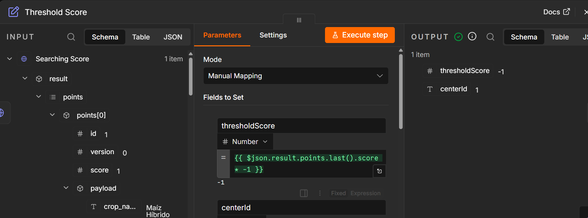

Los filtros matemáticos y de umbral se aplicaron de forma correcta sobre los vectores para aislar los medoides que cumplen con los requisitos específicos de detección de anomalías.

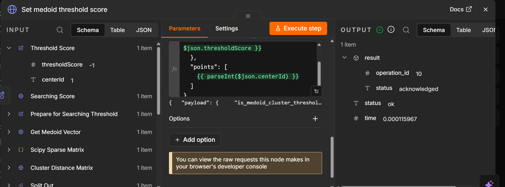
El procesamiento exitoso de los parámetros finales de texto estructurado y la asignacion de el "centro" (o punto más representativo) de un grupo de cultivos en Qdrant

---

# WorkFlows Seguridad

## 09307-Auto-classify-security-incidents-with-GPT-4

### Que hace el flujo de trabajo?

Este flujo de trabajo automatiza el análisis y la clasificación de incidentes de ciberseguridad utilizando inteligencia artificial. Se activa periódicamente de manera programada a través de un disparador de tiempo. Inicialmente, lee una lista de alertas de seguridad pendientes desde una hoja de cálculo en Google Sheets. Posteriormente, envía los datos de cada incidente (como el nombre del host, la dirección IP y el nivel de riesgo) a la API de Gemini mediante un HTTP Request, actuando como un analista virtual que determina la severidad del caso y la acción recomendada en formato JSON. Tras procesar y formatear la información, añade una fila con el veredicto (Timestamp, Hostname, Severity y Action) en una hoja de resultados final dentro de Google Sheets.

### Evidencias

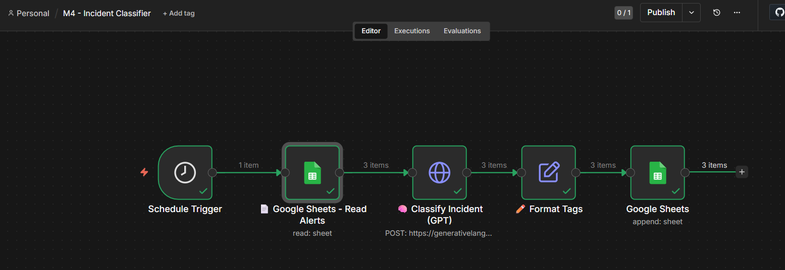

Se demuestra que el flujo de trabajo se ejecutó correctamente de forma secuencial (Schedule Trigger -> Read Alerts -> Classify Incident -> Format Tags -> Google Sheets) sin lanzar excepciones ni errores de autenticación.

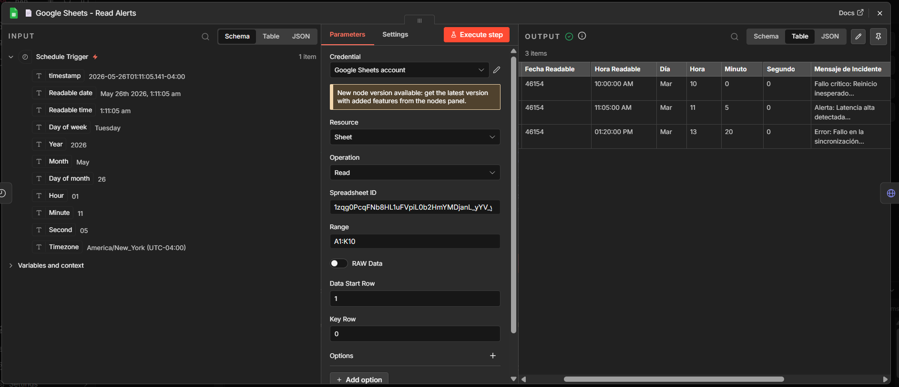

La conexión con la primera hoja de cálculo es exitosa y que el flujo extrajo correctamente los datos de origen (como hostname, ip y risk_score) que alimentarán a la inteligencia artificial.

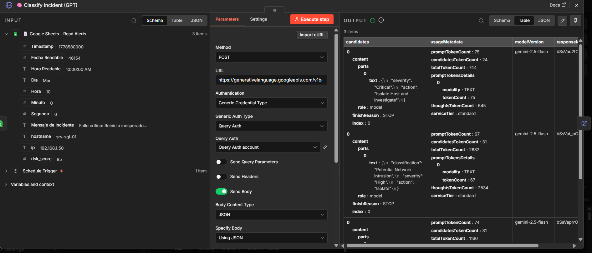
La llamada HTTP a la API devolvió un estado exitoso y que el modelo interpretó el prompt correctamente, entregando una respuesta estructurada con los campos severity y action.

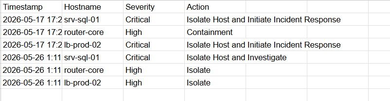

Se guardo con éxito el reporte automatizado.

## 09962-Triage-AWS-security-misconfigurations.json

### Que hace el flujo de trabajo?

Este flujo de trabajo automatiza el triaje y la gestión de alertas de seguridad de AWS (como malas configuraciones de infraestructura) mediante el uso de inteligencia artificial. Se inicia cuando un Webhook recibe eventos provenientes de AWS Security Hub o AWS Config. Primero, un nodo de código normaliza los datos entrantes para estructurar la alerta sin importar su formato de origen. Si el evento es una confirmación de suscripción de AWS SNS, la procesa directamente; en caso contrario, un modelo avanzado de inteligencia artificial (conectado mediante LangChain) analiza la vulnerabilidad detectada para priorizarla. Finalmente, el flujo registra de forma ordenada los detalles del incidente en Airtable y envía automáticamente un mensaje de notificación detallando el problema y la solución recomendada.

### Evidencias

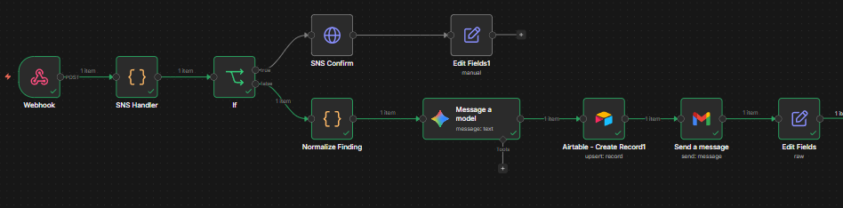

Se demuestra que el flujo de trabajo corrio completo y sin errores.

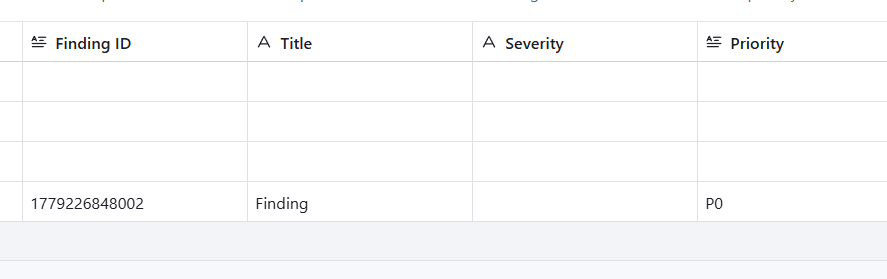
Aqui se muestra que agrego un incidente que dentro de la clasificacion era urgente a la base de datos de Airtable

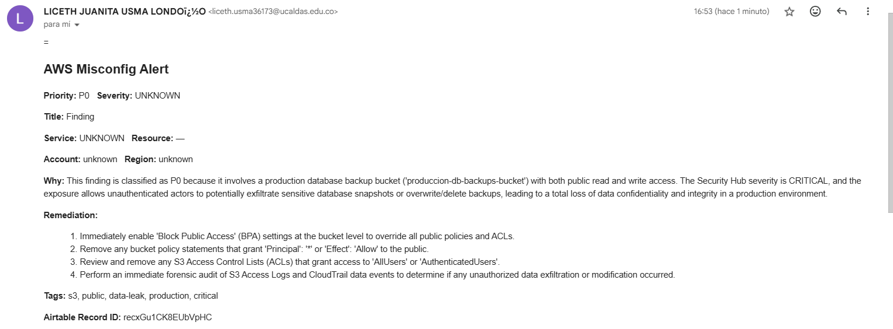
Se envio un correo sobre la deteccion de la vulnerabilidad al equipo

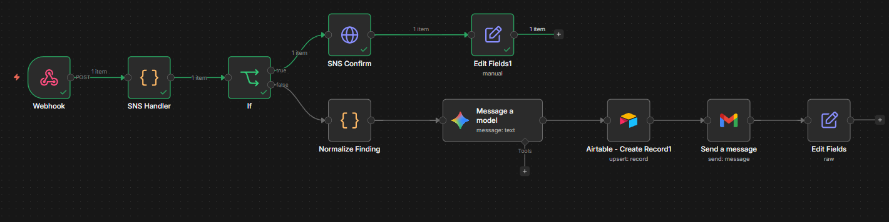

Se corrio el flujo de trabajo alterno

---

## 00460-2666-from-community-Analyze-sort-suspicious-email-contents-with-ChatGPT

### Que hace el flujo de trabajo?
Este flujo de trabajo automatiza la detección, análisis y triaje de correos electrónicos sospechosos (Phishing) mediante inteligencia artificial para agilizar la respuesta ante incidentes. El proceso se activa constantemente al monitorear bandejas de entrada a través de disparadores para Gmail o Microsoft Outlook. Una vez recibido un correo, se extrae su contenido HTML y se genera una captura de pantalla visual del mismo utilizando una herramienta automatizada. En paralelo, el texto del mensaje se envía a un modelo de ChatGPT (OpenAI) para evaluar si contiene elementos maliciosos. Tras la evaluación, un nodo condicional bifurca el camino: si el correo es potencialmente malicioso, crea un ticket de alta prioridad en Jira; si es benigno, genera un ticket de baja prioridad. Finalmente, el flujo renombra el archivo de la captura de pantalla y lo adjunta automáticamente al ticket correspondiente en Jira como evidencia para el equipo de seguridad.

### Evidencias

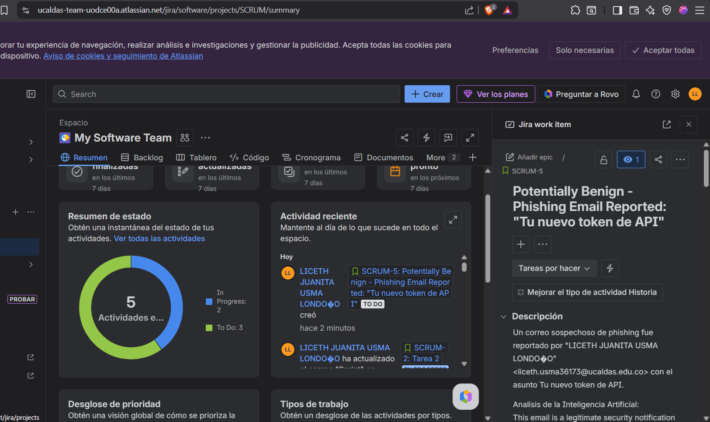

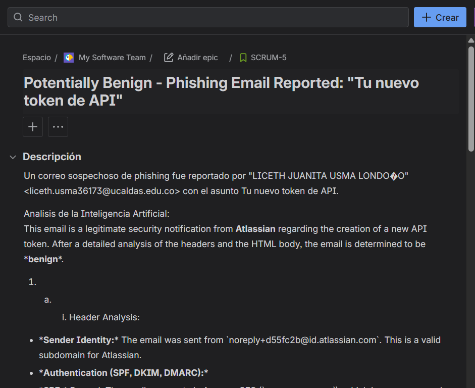

Vista de Jera donde se muestra que analizo mi gmail y encontro una vulnerabildad la proceso y genero un reporte con la informacion de la vulnerabilidad y el riesgo que representa, ademas de recomendaciones en una tarea de Jira para que el equipo de seguridad pueda atenderla.

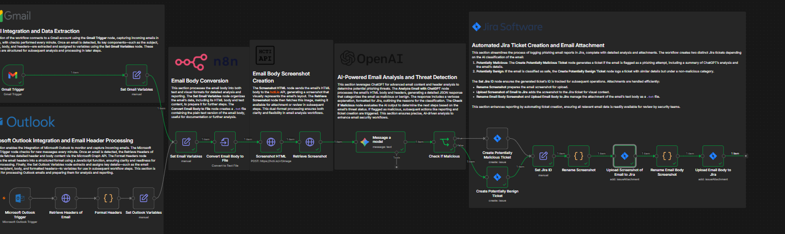
Evidencia de que corrio el flujo 

El apartado outlook hace lo mismo que el de Gmail solo que fue desactivado por los creadores originales del flujo de trabajo.

Nota: Se modifico el modelo original de Open IA por gemini

---

## 09305-CYBERPULSE-AI-BlueOps

### Que hace el flujo de trabajo?
Este flujo de trabajo implementa un motor diario de enriquecimiento y priorización de activos de ciberseguridad. Al activarse de manera programada, extrae en paralelo las amenazas detectadas y el inventario de infraestructura desde hojas de Google Sheets, cruzando ambos listados mediante la dirección IP. Posteriormente, un nodo de código calcula el nivel de impacto real multiplicando el peligro de la amenaza por la criticidad del servidor afectado, asignando automáticamente etiquetas de severidad junto con un manual de respuesta (Playbook). Finalmente, envía alertas críticas por correo electrónico vía SMTP, registra las vulnerabilidades ponderadas en una hoja activa de amenazas, archiva el histórico y limpia la base de datos de origen eliminando las filas ya procesadas.

### Evidencias

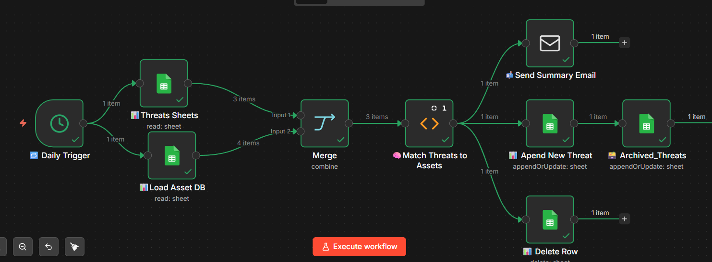

la ejecución del pipeline de ciberseguridad se completó de principio a fin, validando la lógica de las tres ramificaciones concurrentes que parten desde el nodo de enriquecimiento.

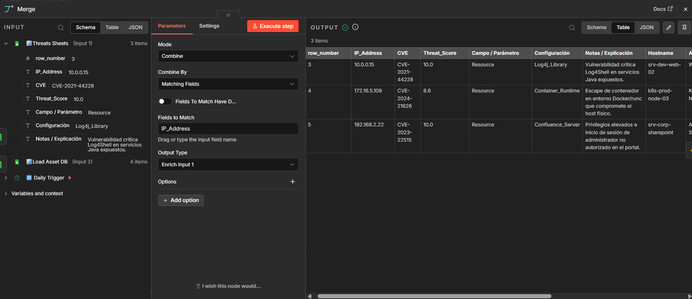
el cruce de datos basado en el campo IP_Address se realizó de forma correcta, consolidando la información de la amenaza con los datos técnicos del servidor.

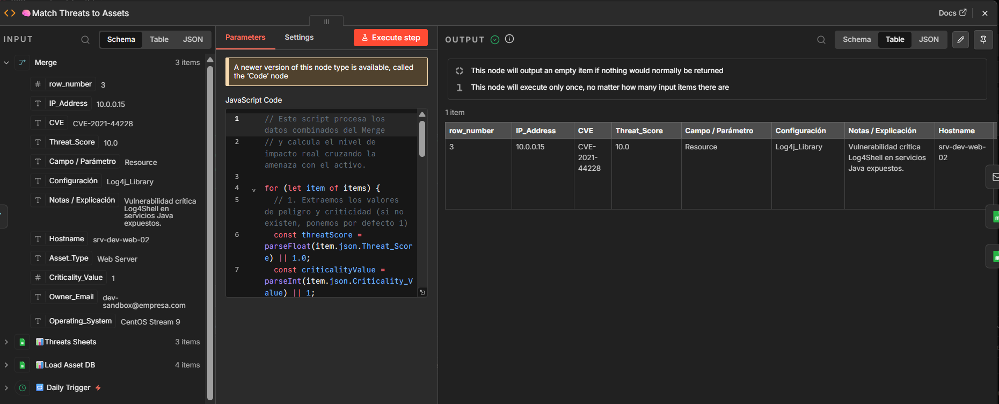

el script de código calculó con éxito el impact_score e inyectó de forma dinámica los campos severity_label y action_playbook requeridos para las automatizaciones posteriores.

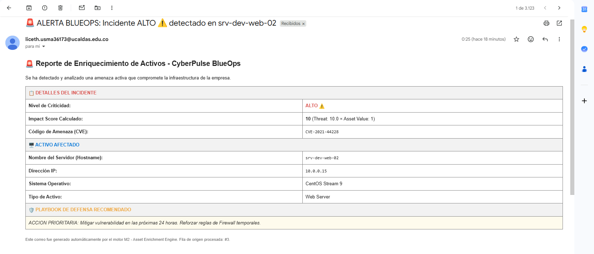

Se envio el correo correctamente

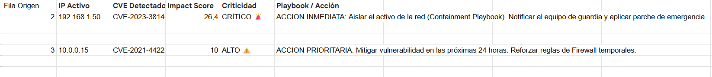

los registros se actualizaron, archivaron y purgaron de manera sincronizada en las hojas de cálculo, confirmando que la fila analizada fue eliminada del listado de pendientes.

---

## 07894-suspicious-login-detection

#### No funcional: 
El flujo no es funcional principalmente porque tiene componentes críticos apagados (disabled: true), como el webhook automático, las consultas a la base de datos Postgres y el envío por Gmail, lo que corta por completo la ruta de análisis histórico. Además, el nodo de condición Unknown threat? está incompleto al no definir contra qué comparar las variables de GreyNoise. Por último, existen errores en el mapeo de variables (como llamar context_ip a un campo guardado como ip), lo que causaría que los nodos posteriores procesen datos vacíos y fallen durante la ejecución.

